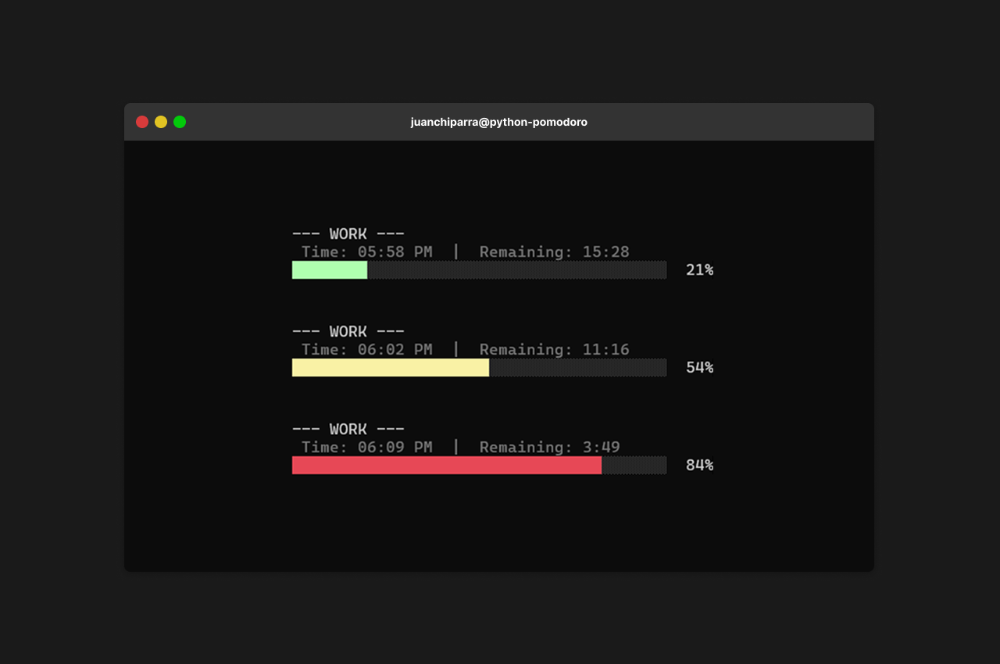

# python-pomodoro

A minimal command-line Pomodoro timer.



## Features

-   Runs continuous Pomodoro cycles (work → break → repeat)
-   Live display: current time + remaining time + progress bar
-   Sound when changing phases

## Getting started

```bash
# Clone this repository
git clone https://github.com/juanchiparra/python-pomodoro.git
cd python-pomodoro

# Run the script
py pomodoro.py #or python pomodoro.py
```

## Configuration

Edit the top constants in pomodoro.py to adjust timings or sound.

```python
# Default values
POMODORO    = 25 * 60   # Focus minutes
SHORT_BREAK = 5 * 60    # Short break
LONG_BREAK  = 15 * 60   # Long break (after 4 pomodoros)
BELL_MODE   = 'tone'    # 'tone' on Windows, else 'ascii'
```

## Prompt behavior

-   After short breaks: "Press enter to continue...".
-   Long break resumes automatically

## Progress bar

-   Color thresholds: <50% green, 50–79% yellow, ≥80% red

## Controls

-   Ctrl+C: stop current interval
-   Ctrl+C again right after a phase switches: exit

## Environment & Sound behavior

| Environment      | Colors | Sound Mode  | Notes                                  |
| ---------------- | ------ | ----------- | -------------------------------------- |
| Windows CMD      | Yes    | tone        | Recommended baseline                   |
| Windows Terminal | Yes    | tone / bell | Depends on bell settings               |
| PowerShell       | Yes    | tone        |                                        |
| Linux / macOS    | Yes    | ASCII bell  | Use desktop notifications if inaudible |

## Troubleshooting

| Issue       | Fix                                        |
| ----------- | ------------------------------------------ |
| No sound    | Try different terminal, set tone or volume |
| Garbled bar | Terminal lacks ANSI; use a modern one      |
| Silent '\a' | Terminal mutes bell; try another method    |

## Code structure

| Section                                             | Purpose                                           |
| --------------------------------------------------- | ------------------------------------------------- |
| Constants (`POMODORO`, `SHORT_BREAK`, `LONG_BREAK`) | Base durations (seconds)                          |
| `BELL_MODE`                                         | Selects sound behavior                            |
| ANSI colors                                         | Colors only if running in an interactive terminal |
| `render_status_line`                                | Renders info header + progress bar                |
| `beep`, `beep_n`                                    | Single or repeated beeps with graceful fallback   |
| `pomodoro_timer`                                    | Runs one timed interval and updates display       |
| `main`                                              | Infinite loop alternating work and breaks         |

## Usage Tips

-   Stick to classic 25/5/15 until consistent, then adjust.
-   Reserve Ctrl+C for genuine interruptions (avoid creating a habit loop).
-   Keep the terminal visible or docked to maintain focus

## Contributions

Contributions are welcome! If you encounter a problem or have an idea to improve the project, open an issue or send a pull request
